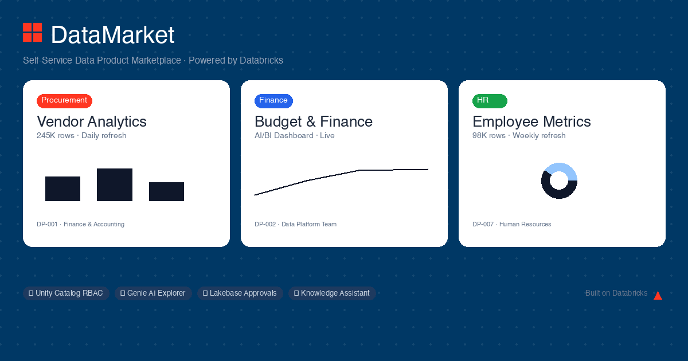

# DataMarket — Self-Service Data Product Marketplace on Databricks



A production-ready demo of a governed, self-service data product marketplace built **entirely on Databricks**. Designed to show enterprise and public sector customers that a modern data portal — with AI features, real RBAC enforcement, and persistent workflows — can be delivered natively, without third-party vendor tooling.

> **Origin:** Built as a proof-of-concept to show how Databricks can replace proprietary third-party data portals. Reusable across any industry vertical.

---

## What It Does

- **Data Catalog** — Browse and search data products (dashboards, datasets, reports) with domain filters, classification tags, and per-user access status
- **Access Request Workflow** — Business users request access with a justification; requests persist to Lakebase Postgres in real time
- **Admin Approval Queue** — Data Stewards approve/deny requests; each approval automatically generates a Unity Catalog `GRANT SELECT` statement
- **My Library** — Personal shelf of approved and pinned data products per user
- **RBAC Demo** — Three built-in personas (Analyst, Manager, Data Steward) demonstrate the full access control story without requiring real user accounts
- **AI Explorer** — Natural language → SQL backed by a live Databricks Genie Space
- **Analytics Dashboards** — Native Lakeview AI/BI dashboards embedded in the portal
- **Document Assistant** — RAG-powered chat on data dictionaries and governance docs via Knowledge Assistant
- **Audit Trail** — Every action logged persistently to Lakebase

---

## Architecture

```
Browser (React + Tailwind)
        │  SSO (Entra ID / SAML)
        ▼
Databricks App (Serverless Node.js / Express)
  /api/portal/products  · /requests  · /library  · /audit
        │                          │
  Lakebase (Postgres)        Unity Catalog (Delta)
  datamarket schema          your_catalog.your_schema.*
  ─ users                    ─ your gold/curated tables
  ─ data_products
  ─ access_requests
  ─ audit_log
  ─ user_library
        │
  AI/BI Dashboard · Genie Space · Knowledge Assistant
```

---

## Tech Stack

| Layer | Technology |
|---|---|
| Frontend | React 18, Vite, Tailwind CSS, shadcn/ui, Recharts |
| Backend | Node.js, Express.js |
| Database (OLTP) | Lakebase (Databricks managed Postgres) |
| Data / Governance | Unity Catalog (Delta tables, RBAC) |
| Hosting | Databricks Apps (serverless, SSO auth baked in) |
| AI Features | Genie Space, Knowledge Assistant, AI/BI Dashboards |

---

## Project Structure

```
src/app/
├── app.js              # Express server — Lakebase API routes
├── app.yaml            # Databricks Apps config
├── package.json        # Dependencies (pg, express, compression, cors, helmet)
├── .env.example        # All required environment variables documented
├── src/
│   ├── App.jsx         # Root router and layout
│   ├── context/
│   │   └── PersonaContext.jsx   # RBAC persona state + API calls
│   ├── pages/
│   │   ├── DataMarketHomePage.jsx
│   │   ├── DataMarketCatalogPage.jsx
│   │   ├── DataMarketProductDetailPage.jsx
│   │   ├── DataMarketLibraryPage.jsx
│   │   ├── DataMarketRegisterPage.jsx
│   │   ├── DataMarketAdminPage.jsx
│   │   ├── AIExplorerPage.jsx
│   │   ├── BudgetFinancePage.jsx
│   │   ├── InternalBillingPage.jsx
│   │   └── DocumentsPage.jsx
│   └── components/
│       └── layout/
│           └── DataMarketLayout.jsx  # Top-nav shell with persona switcher
docs/
└── consumption_model.md         # Platform consumption projection model
```

---

## Lakebase Schema (`datamarket`)

| Table | Purpose |
|---|---|
| `users` | Portal users — email, role, department |
| `data_products` | Catalog entries with UC full names |
| `access_requests` | Requests with status, reason, UC grant SQL |
| `audit_log` | Every submit/approve/deny action |
| `user_library` | Per-user pinned and approved products |

Once registered as a UC catalog, tables are queryable directly from Databricks SQL.

---

## API Endpoints

| Method | Path | Description |
|---|---|---|
| `GET` | `/api/portal/products` | List data products (filterable by domain, type, search) |
| `GET` | `/api/portal/requests?email=` | Requests for a specific user |
| `GET` | `/api/portal/requests/pending` | Admin approval queue |
| `POST` | `/api/portal/requests` | Submit new access request |
| `PUT` | `/api/portal/requests/:id/approve` | Approve + log UC grant SQL |
| `PUT` | `/api/portal/requests/:id/deny` | Deny with reason |
| `GET` | `/api/portal/library?email=` | User's approved + pinned products |
| `GET` | `/api/portal/audit` | Recent audit log entries |

---

## Getting Started

### 1. Clone and install

```bash
git clone https://github.com/YOUR_ORG/datamarket-databricks.git
cd datamarket-databricks/src/app
npm install
```

### 2. Configure environment variables

```bash
cp .env.example .env
# Fill in your Databricks workspace, Lakebase instance, and user details
```

### 3. Set up Lakebase

```bash
# Create a Lakebase instance (CU_1 is sufficient for demos)
databricks database create-database-instance YOUR_INSTANCE_NAME \
  --enable-pg-native-login \
  --capacity CU_1 \
  --profile YOUR_PROFILE

# Generate a short-lived credential and connect via psql to seed the schema
LAKEBASE_TOKEN=$(databricks database generate-database-credential \
  --json '{"instance_names": ["YOUR_INSTANCE_NAME"]}' \
  --profile YOUR_PROFILE --output json | python3 -c "import sys,json; print(json.load(sys.stdin)['token'])")

PGPASSWORD="$LAKEBASE_TOKEN" psql \
  -h YOUR_LAKEBASE_HOST -p 5432 \
  -U YOUR_EMAIL -d databricks_postgres \
  --set=sslmode=require \
  -c "CREATE SCHEMA IF NOT EXISTS datamarket;"

# Then run the seed script (see schema/seed.sql)
PGPASSWORD="$LAKEBASE_TOKEN" psql \
  -h YOUR_LAKEBASE_HOST -p 5432 \
  -U YOUR_EMAIL -d databricks_postgres \
  --set=sslmode=require \
  -f schema/seed.sql
```

> **Tip — Lakebase host:** Find it under `read_write_dns` in the output of `databricks database get-database-instance YOUR_INSTANCE_NAME`.

### 4. Expose Lakebase to Unity Catalog (recommended)

This step creates a federated catalog so you can query Lakebase tables directly from notebooks, SQL Editor, and AI/BI dashboards — and is the recommended way to demo the Lakehouse integration:

```bash
databricks database create-database-catalog \
  datamarket_lakebase \
  YOUR_INSTANCE_NAME \
  databricks_postgres \
  --profile YOUR_PROFILE
```

After this, `SELECT * FROM datamarket_lakebase.datamarket.access_requests` works in any notebook or SQL Editor in the workspace.

### 5. Run locally

```bash
npm run dev          # Vite dev server on :5173
node app.js          # Express API on :3000
```

### 5. Deploy to Databricks Apps

```bash
# Upload source to workspace and deploy
databricks apps deploy YOUR_APP_NAME \
  --source-code-path /Workspace/Users/you@domain.com/datamarket \
  --profile YOUR_PROFILE
```

---

## Customizing for Your Customer

| What to change | Where |
|---|---|
| Branding / org name | `src/components/layout/DataMarketLayout.jsx` |
| Persona names and departments | `src/context/PersonaContext.jsx` |
| Seed data products | `src/pages/DataMarketCatalogPage.jsx` + Lakebase seed script |
| UC catalog and table names | `.env` → `LAKEBASE_DB`, `LAKEBASE_SCHEMA` |
| Dashboard URL | `.env` → `VITE_DASHBOARD_URL` |
| Genie Space ID | `src/pages/AIExplorerPage.jsx` |

---

## Why Databricks Native vs. Third-Party Portals

| | Third-Party (e.g. Aspire, Collibra) | DataMarket (Databricks Native) |
|---|---|---|
| Data ownership | Data piped into vendor layer | Stays in Unity Catalog |
| Access control | Vendor UI + separate policy | UC GRANT/REVOKE, enforced at engine |
| AI features | Add-on / roadmap | Genie + Knowledge Assistant, live day one |
| Infrastructure | Containers, VMs to manage | Serverless Databricks Apps |
| Login | New identity system | Existing SSO (Entra ID / SAML) |
| Audit trail | Internal to vendor | Persistent Postgres, SQL-queryable |
| Change requests | Vendor SOW + cost | Edit a React file |

---

## License

MIT — see [LICENSE](LICENSE)
